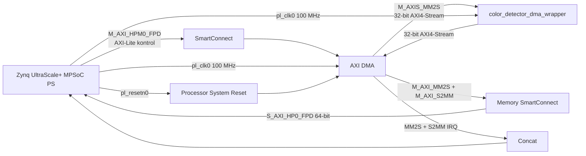

# KV260 — Genel blob algılama ve görüntü üzerine kutular

**Orijinal kamera görüntüsü korunur; canlı ayarda yalnız kırmızı, yeşil ve mavi
bağlı bölgeler kutulanır.** FPGA'daki elle yazılmış RTL komşu piksel farklarını
hesaplar, PS bölgeleri birleştirip RGB filtresini ve kutuları uygular. Hedef 640×480 / 30 FPS.
Ölçülmüş sonuçlar [doğrulama kaydında](docs/validation.md).

## Sistem blok diyagramı

```mermaid
flowchart LR
    CAM[USB UVC Kamera<br/>640×480 YUYV] --> V4L2[V4L2 yakalama<br/>PS / Linux]
    V4L2 --> RGB[YUYV → RGB888<br/>PS yazılımı]
    RGB --> IN[(DDR giriş tamponu<br/>R,G,B,0)]
    IN --> MM2S[AXI DMA<br/>MM2S]
    MM2S --> RTL[Handwritten RTL<br/>color_detector_axis]
    RTL --> S2MM[AXI DMA<br/>S2MM]
    S2MM --> OUT[(DDR fark haritası<br/>left,up,0,0)]
    OUT --> BLOBS[PS connected-component<br/>RGB blob filtresi]
    RGB --> BLOBS
    BLOBS --> BOX[Orijinal görüntüye<br/>bounding box overlay]
    BOX --> UDP[UDP paketleyici<br/>768 paket/kare]
    UDP --> ETH[Gigabit Ethernet]
    ETH --> PC[Python + OpenCV<br/>PC görüntüleme]
```



PL, görüntüyü maskelemez: her piksel için soldaki ve üstteki komşuya olan RGB
farkını üretir. PS bu fark haritasını orijinal RGB kareyle birlikte kullanarak
bağlı bölgeleri bulur. Canlı ayarda yalnız baskın kırmızı, yeşil ve mavi bölgeler
kalır; kutular orijinal görüntünün üzerine çizilir.

### Vivado PL bağlantısı



RTL ayrıntıları, veri biçimleri ve backpressure davranışı için
[mimari dokümanına](docs/architecture.md) bakın.

- `rtl/`: AXIS, satır BRAM'i, self-checking testbench.
- `ps/camera_udp.cpp`, `ps/color_boxes.hpp`: kamera, DMA, blob, overlay ve UDP.
- `pc/udp_receiver.py`: ayrı UDP/GUI iş parçacıkları; alınan/görüntülenen FPS.
- `vivado/`: BD, PS preset, fan kısıtı ve Linux overlay.
- [Ayrıntılı mimari](docs/architecture.md) · [Vivado](vivado/README.md) ·
  [doğrulama](docs/validation.md).

## Derleme

```bash
bash scripts/build_software.sh
bash scripts/simulate.sh
python3 scripts/background.py fpga
# Başarılı FPGA derlemesinden sonra:
bash scripts/package.sh
```

Vivado 2022.2; varsayılan kurulum `/mnt/data/Xilinx/Vivado/2022.2/bin`.
Yeni FPGA projesi `COLOR_BUILD_DIR` altında oluşturulur; bu makinede
`/mnt/data/kria_build/kv260_color_overlay_20260917`. Eski kırmızı maske paketi
`build/red_v1/` altında korunur; yeni paketin adı `kv260-blob-overlay`.

## PC

```bash
python3 -m pip install -r pc/requirements.txt
python3 pc/udp_receiver.py --bind 10.42.0.1 --source 10.42.0.12 --port 5000
```

Pencere: **KV260 blob overlay**. `q`/Escape kapanış. `--snapshot kare.png` ilk tam
kareyi kaydeder. `--headless --frames 120 --idle-exit 5` görüntüsüz ölçüm içindir.
PC güvenlik duvarında Kria'dan UDP/5000'e izin gerekir.

## KV260

Yeni bitstream/overlay yüklendikten sonra, `camera_udp.cpp` ve `color_boxes.hpp`
aynı klasörde olmalıdır:

```bash
g++ -std=c++17 -O3 -Wall -Wextra camera_udp.cpp -ldl -pthread -o camera_udp
sudo ./camera_udp --ip 10.42.0.1 --dma-base 0xa0000000 --test-pattern --frames 10 --fps 30
sudo ./camera_udp --ip 10.42.0.1 --dma-base 0xa0000000 --device /dev/video0 --fps 30
```

Canlı RGB ve ışık/gölge ayarı: `--primary-only --min-area 200 --tolerance 52 --edge-threshold 36`.
`ps/run_live.sh`, `camera_udp` ile aynı klasöre konduğunda bu toleransları uygular;
`sudo ./run_live.sh --ip 10.42.0.1 --dma-base 0xa0000000 --device /dev/video0 --fps 30`
ile başlatılır. `--primary-only` verilmezse genel blob modu hâlâ kullanılabilir.
Programın temel varsayılanları 36/24 olarak korunur.
Daha büyük tolerance, renk gölgelerini daha kolay birleştirir. Min-area artırmak
küçük parazit kutuları azaltır. Kamera biçimi YUYV ise BT.601 limited dönüşüm
PS'de yapılır. Görüntüde semantik nesneler değil, bağlı renk/doku bölgeleri bulunur.

Eski kırmızı maske bitstream'i yeni yazılımla uyumlu değildir. Aynı kamera/DMA
iki program tarafından eşzamanlı kullanılmamalıdır. XRT/zocl cache/bellek yönetimi
zorunludur; DMA hatasında CPU algılamaya otomatik geçiş yapılmaz.
