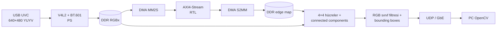
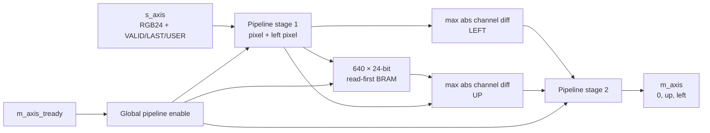

# Genel blob algılama ve canlı görüntü



RTL herhangi bir sabit renk sınıfına bağlı değildir. PS'nin canlı
`--primary-only` modu yalnız belirgin kırmızı, yeşil ve mavi blobları tutar;
bayrak verilmezse camgöbeği, mor, turuncu ve gri gibi diğer bağlı bölgeler de
genel blob kuralıyla değerlendirilebilir. Bu bir nesne tanıma modeli değildir.

## FPGA görevi

Eski entegrasyon adı `color_detector_axis` korunur; işlev artık genel RGB
komşuluk farkıdır. 24 bit giriş: düşük bayt R, sonra G, B.



```text
left = max(abs(R-R_left), abs(G-G_left), abs(B-B_left))
up   = max(abs(R-R_up),   abs(G-G_up),   abs(B-B_up))
output[7:0] = left
output[15:8] = up
output[23:16] = 0
```

İlk sütunun left, ilk satırın up değeri 255'tir. Önceki satır 640×24 bit
senkron read-first BRAM'de tutulur. İki aşamalı pipeline normalde saat başına
bir piksel kabul eder; backpressure tüm aşamaları tutar. TLAST kare sonudur;
TUSER değiştirilmeden taşınır. Reset RAM'i temizlemez; ilk-satır işareti eski
veriyi gizler. HLS kullanılmaz.

AXI4-Stream sözleşmesi şöyledir:

| Sinyal | Davranış |
|---|---|
| `TVALID` | Her iki pipeline aşamasıyla taşınır. |
| `TREADY` | Çıkış dolu ve alıcı hazır değilse düşer; pipeline ve BRAM adresi donar. |
| `TLAST` | DMA karesinin son pikselini gösterir ve kare/sütun durumunu sıfırlar. |
| `TUSER` | Çekirdek içinde değiştirilmeden taşınır; DMA wrapper girişte 0 bağlar. |
| `TDATA` | Giriş `{B,G,R}`; çıkış `{0,up_delta,left_delta}`. |

Normal durumda çekirdek her saat çevriminde bir piksel kabul eder. 100 MHz PL
saatinde hesaplama kapasitesi 640×480×30 akış ihtiyacının üzerindedir; ölçülen
uçtan uca hız kamera dönüşümü, DDR/cache işlemleri ve UDP aktarımını da içerir.

## PS ve PL görev ayrımı

| Aşama | Yer | İşlev |
|---|---|---|
| Kamera yakalama | PS/Linux | V4L2 MMAP, 640×480 YUYV |
| Renk dönüşümü | PS | BT.601 limited YUYV → RGB888 |
| Komşuluk farkı | PL/RTL | Sol ve üst piksele maksimum RGB kanal farkı |
| Bölge büyütme | PS | 4×4 hücrelerde dört komşulu connected components |
| RGB eleme | PS | Baskın kırmızı, yeşil ve mavi bölgeleri seçme |
| Overlay | PS | Orijinal kareye üç piksel kalınlığında kutu |
| Ağ ve görüntü | PS + PC | UDP paketleme, yeniden birleştirme, OpenCV |

DMA wrapper 32 bit piksel kelimelerini kullanır. Giriş R,G,B,0; çıkış
left,up,0,0. TKEEP=1111. İki DMA yönünde de kare uzunluğu 1,228,800 bayttır.
PS sanal adresi DMA'ya verilmez: XRT/zocl fiziksel tampon + cache sync kullanılır.
S2MM önce başlatılır; taze IOC ve doğru alınan uzunluk kontrol edilir.

## Blob ve kutular

PS, orijinal RGB kareyi saklar. Algılama için 4×4 hücrelerin ortalama rengini
ve FPGA'dan gelen hücre sınırı farklarını kullanır. Dört yönde bağlı bölge büyütülür:

- Komşu sınır farkı `--edge-threshold` değerini aşmamalı (varsayılan 24).
- Hücre rengi bölgenin başlangıç rengine kanal başına `--tolerance` kadar yakın olmalı (36).
- Bu ikinci koşul, yumuşak bir renk geçişinin bütün sahneyi tek blob yapmasını önler.
- `--min-area` altı bölgeler atılır (200 piksel).
- Karenin %60'ından büyük bölgeler; üç kenara yayılıp %10'u geçen bölgeler
  arka plan kabul edilir. En fazla 24 büyük blob gösterilir.
- Kutu koordinatları 4 piksel çözünürlüktedir. Kutular nesneyi semantik olarak tanımaz;
  dokulu veya çok gölgeli nesneler birden çok blob oluşturabilir.

Kutunun içindeki kamera pikselleri değiştirilmez; yalnız 3 piksel kalınlıkta
kenar çizilir. RGB modunda kutu ilgili sınıfın saf kırmızı, yeşil veya mavi
rengiyle çizilir. Genel modda kenar rengi blobun ortalama renginden türetilir.
Eşikler C++ komut satırından değişir;
bitstream derlemesi gerektirmez.

## Yüksek FPS düzeni

İlk sürümde XRT belleğini küçük piksel erişimleriyle okumak yaklaşık 68 ms/kare
sürüyordu. Cached CPU tamponuna toplu okuma yaklaşık 9 ms ölçüldü. RGB paketleme
de cached uint32 tamponda yapılıp tek memcpy ile DMA belleğine yazılır.

Kamera/PL işleme ve UDP gönderimi ayrı iş parçacıklarıdır. Göndericide yalnız
bir bekleyen kare vardır; ağ yavaşlarsa en yeni kare eskisinin yerini alır.
UDP sendmmsg ile 16 paketlik gruplar halinde gönderilir; gruplar arasında kısa
aralık vardır. PC'de UDP alımı GUI'den ayrı çalışır ve sadece en yeni tam kare
GUI'ye verilir. FPS logları alınan ve görüntülenen kareleri ayrı sayar.

## UDP sözleşmesi

640×480 RGB888 = 921,600 bayt = 768 paket. Her paket en fazla 1200 bayt RGB
verisi taşır; UDP verisi 10 bayt başlıkla en fazla 1210 bayttır.
Başlık network byte order: `!IHHH` = frame_id(uint32), packet_id(uint16),
total_packets(uint16), payload_size(uint16). Sırasız ve tekrar paketler ele alınır;
0.5 saniyede tamamlanmayan kare atılır; en fazla üç kare tutulur.
30 FPS ham RGB yükü 221.2 Mbit/s'dir (protokol ek yükü hariç).

## Test sınırları

`--transport-test` yalnız ağ testi yapar. `--test-pattern` ise beş farklı
renk/parlaklıkta dikdörtgeni GERÇEK FPGA'dan geçirir, her komşuluk farkını CPU
referansıyla ve beş kutuyu bilinen koordinatlarla karşılaştırır. Canlı FPS ayrıca
kart ve PC günlüklerinden ölçülür. Güncel sonuçlar `validation.md` içindedir.
